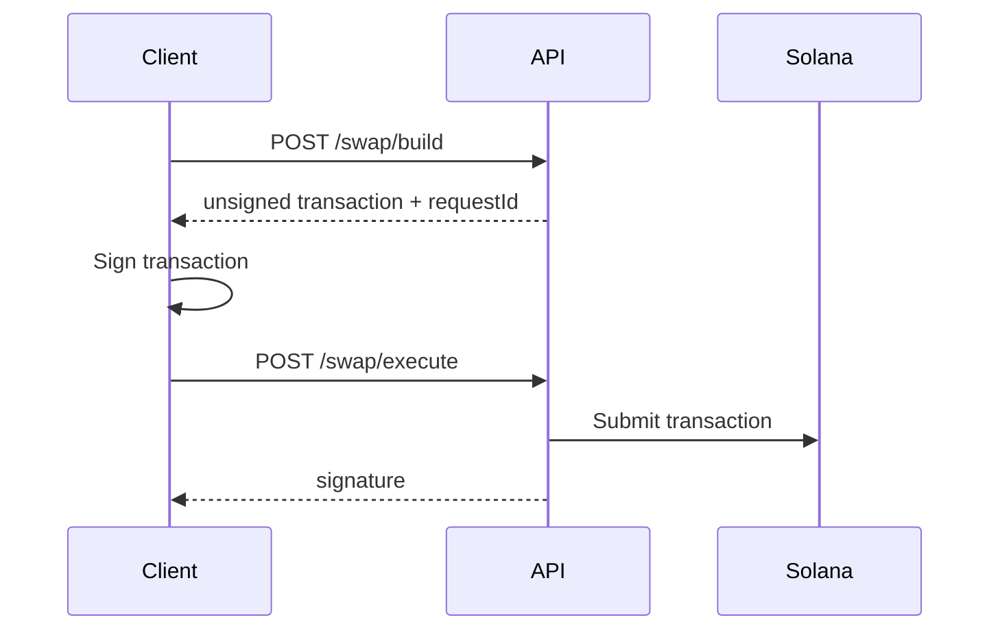

## Overview

The Trading API enables developers to build applications that interact with futarchy proposal markets on Combinator. All trading operations use a **build/execute pattern** where transactions are constructed server-side and signed client-side.

## Base URL

```
https://api.zcombinator.io
```

All endpoints are prefixed with `/dao/proposal/:proposalPda`.

## Authentication

The Trading API is **publicly accessible** - no API key is required for read operations. Write operations (build/execute) require a valid wallet signature.

## Build/Execute Pattern

All state-changing operations follow a two-step pattern:

1. **Build** - Request a transaction from the API
2. **Execute** - Sign and submit the transaction



### Request Expiry

Built transactions expire after **15 minutes** (blockhash expiry). If a transaction expires, you must rebuild it.

## Proposal States

Proposals exist in one of three states:

| State | Description | Available Operations |
|-------|-------------|---------------------|
| `pending` | Active trading period | swap, deposit, withdraw |
| `resolved` | Outcome determined | redeem |
| `initialized` | Setup phase | none |

## Vault Types

Each proposal has two vault types for conditional tokens:

- **`base`** - The DAO's native token (e.g., ZC)
- **`quote`** - The quote currency (e.g., USDC)

## Pool Indices

Binary proposals have two pools:

| Index | Outcome | Meaning |
|-------|---------|---------|
| `0` | Pass | Proposal passes |
| `1` | Fail | Proposal fails |

## Error Handling

All errors return a consistent format:

```json
{
  "error": "Human-readable error message",
  "details": "Technical details (optional)"
}
```

### Common Error Codes

| Status | Description |
|--------|-------------|
| `400` | Invalid request parameters |
| `404` | Proposal not found |
| `500` | Server error |

## Rate Limits

Currently no rate limits are enforced. Please be respectful with request frequency.

## Endpoints Reference

### Read Operations

| Endpoint | Description |
|----------|-------------|
| [Market Status](/api-reference/trading/market-status) | TWAP, spot prices, leading option |
| [Quote](/api-reference/trading/quote) | Get swap quote |
| [Balances](/api-reference/trading/balances) | User token balances |

### Trading Operations

| Endpoint | Description |
|----------|-------------|
| [Swap](/api-reference/trading/swap) | Trade conditional tokens in AMM pools |

### Vault Operations

| Endpoint | Description |
|----------|-------------|
| [Deposit](/api-reference/trading/deposit) | Split regular tokens into conditional tokens |
| [Withdraw](/api-reference/trading/withdraw) | Merge conditional tokens back to regular |
| [Redeem](/api-reference/trading/redeem) | Convert winning tokens after resolution |
